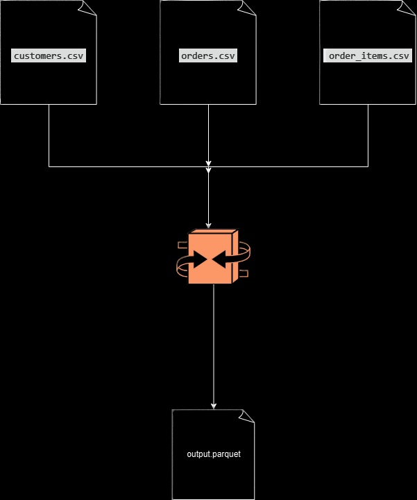

## **🔄 Data Processing Pipeline**

### **Step-by-Step Transformation Flow**



### **Detailed Processing Steps:**

1. **📥 Extract & Clean**
   - Load `customers.csv`, `orders.csv`, `order_items.csv`
   - Remove nulls, duplicates, fix data quality issues
   
2. **🔗 Join Datasets**
   ```
   customers + orders    →   [customer_id, customer_name, order_id, order_date, status]
                              ↓
                       + order_items  →  [customer_id, order_id, order_date, product_id, quantity]
   ```

3. **📋 Schema Transformation**
   - **Select only** columns from `schema.json`
   - **Convert types**: string → `date`, `long`, etc.
   - **Enforce nullability** rules from schema

4. **💾 Output Parquet**
   - Write optimized columnar Parquet format
   - **Ready for BigQuery, Snowflake, Redshift**

### **Visual Pipeline:**
```

```

### **Why This Architecture?**

```
CSV Limitations ❌        →       Parquet Advantages ✅
├── No schema/types      →      ✅ Typed schema preserved
├── Slow queries         →      ✅ 10x faster columnar reads
├── Huge file sizes      →      ✅ 90% compression
├── No partitioning      →      ✅ Optimized for analytics
└── Hard to analyze      →      ✅ BigQuery-ready instantly
```

### **Production Ready Output:**
```
output/
├── part-00000.snappy.parquet     ✅ Schema enforced
├── part-00001.snappy.parquet     ✅ Types converted  
└── _SUCCESS                      ✅ Ready for data warehouse
```

```
# Load in BigQuery (1 command):
bq load --source_format=PARQUET dataset.table output/
```

**This pipeline transforms raw e-commerce CSVs into a clean, typed, analytics-ready Parquet dataset - perfect for cloud data warehouses!** 🎯

***

**Copy this into your README.md under "Data Processing Pipeline" section!** 🚀
